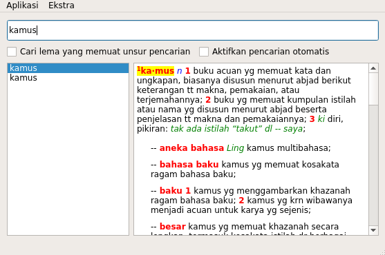
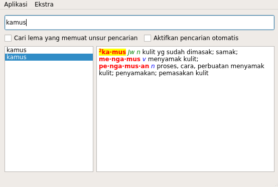
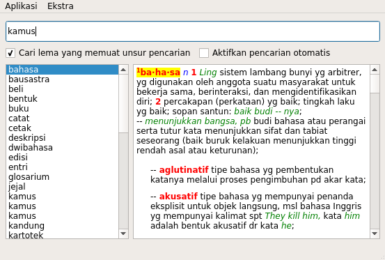

# 1. Pengenalan KBBI-Qt
## 1.1 Apa itu KBBI-Qt?
KBBI-Qt adalah aplikasi Kamus Besar Bahasa Indonesia yang dikembangkan dengan bahasa pemrograman C++ dan Framework Qt.

Dirilis dengan lisensi GNU GPL v3.0, maka KBBI Qt adalah ([free software](https://www.gnu.org/philosophy/free-sw.en.html)), sehingga aplikasi yang dikembangkan oleh komunitas Belajar GNU/Linux Indonesia (BGLI) ini bebas dijalankan untuk tujuan apa pun, digunakan, didistribusikan (baik berbayar atau gratis), disalin, dimodifikasi, dan dikembangkan.

## 1.2 Keuntungan menggunakan KBBI-qt
Badan Pengembangan dan Pembinaan Bahasa (Badan Bahasa) serta Kementerian Pendidikan dan Kebudayaan (Kemendikbud) sebenarnya telah merilis aplikasi KBBI berbasis web; [kbbi.web.id][0] (KBBI III), [kbbi4.portalbahasa.com][1] (KBBI IV), dan [kbbi.kemdikbud.go.id][2] (KBBI V). Namun, ketiganya memiliki kekurangan, yakni pengguna harus dalam keadaan daring untuk mengaksesnya.

KBBI-Qt ingin memastikan bahwa pengguna bisa mengakses KBBI dalam keadaan luring melalui komputer atau laptop.

# 2. Pemasangan KBBI-Qt
Beberapa kontributor telah memaketkan aplikasi KBBI-Qt ke paket-paket distro tertentu. Berikut cara instal KBBI-Qt di CentOS/RHEL7 dan Fedora 23/34/25/Rawhide. Serta cara instal melalui *source code* (*compile* manual).

## 2.1 Di CentOS/RHEL7
    $ sudo wget https://copr.fedorainfracloud.org/coprs/alunux/kbbi-qt-git/repo/epel-7/alunux-kbbi-qt-git-epel-7.repo -O /etc/yum.repos.d/kbbi-qt.repo
    $ sudo yum install KBBI-Qt

## 2.2 Di Fedora 23/24/25/Rawhide
    $ sudo dnf copr enable alunux/kbbi-qt-git
    $ sudo dnf install KBBI-Qt

## 2.4 Di distro X

## 2.x Instal dari source code

    $ git clone https://github.com/bgli/kbbi-qt.git
    $ cd kbbi-qt/src
    $ qmake -project
    $ make

# 3. Pengenalan antarmuka

# 4. Penggunaan KBBI-Qt

## 4.1 Cari arti kata

Untuk mencari arti kata "kamus", ketikkan kata "kamus" dalam kolom pencarian, lalu klik tombol "Cari" atau tekan Enter pada *keyboard*.

Hasil pencarian akan muncul pada kolom kanan, lihat gambar di bawah ini.

Jika kata yang dicari mengandung lebih dari satu arti, kata akan muncul sebanyak arti kata tersebut. Lihat pada hasil pencarian arti kata "kamus" di poin 4.1, kata "kamus" memiliki dua arti, sehingga ia akan muncul dua kali. Untuk melihat arti lain dari kata "kamus", silakan klik kata "kamus" lainnya atau gunakan tombol panah (atas bawah) pada *keyboard*.

## 4.2 Cari arti atau kata yang mengandung lema

Centang pada "Cari lema yang memuat unsur pencarian" untuk menghasilkan daftar lema yang artinya memuat kata yang dicari.

Misal, kata "kamus" termuat dalam arti kata "bahasa", "bausastra", "beli", dll.

## 4.3 Perbesar fonta pada kolom hasil pencarian

Klik kolom hasil pencarian, tahan tombol *Ctrl* pada *keyboard*, lalu *scroll* menggunakan *mouse*.

# 5. Solusi masalah, misal kalau ada masalah di distro tertentu, bukan bug (opsional)

[0]: http://kbbi.web.id
[1]: http://kbbi4.portalbahasa.com
[2]: http://kbbi.kemdikbud.go.id/
[4]: https://www.gnu.org/philosophy/free-sw.en.html
